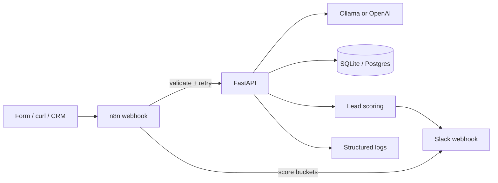

# Architecture

## Flow

A request can skip n8n and hit FastAPI directly (`POST /api/v1/intake` or the legacy `POST /webhook/intake`). n8n is the optional orchestration layer: validation, retries, timeout, and queue routing.

## Components

| Piece | Role |
| --- | --- |
| FastAPI | Validate payload, call LLM, persist lead, score, notify |
| AI service | `AI_PROVIDER=ollama` (default `llama3.2`) or `openai`. JSON is parsed and checked with Pydantic. Failures do **not** drop the row. |
| SQLAlchemy | `DATABASE_URL`. SQLite default for demo/tests. `postgresql+psycopg://` for compose/prod. |
| Scoring | LLM score when valid; heuristic score + department when the model is down |
| Notifications | Slack incoming webhook; SMTP if configured; otherwise the same payload is logged |
| Auth | `X-API-Key` on POST/PATCH and GET `/api/v1/leads`. `GET /health` is public. |

## Schema

`leads` stores:

- Identity: UUID `id`, timestamps, `status`
- Raw intake fields (name, company, email, phone, service, budget, description, deadline, source)
- Structured AI columns plus `raw_intake` JSON and `ai_response` JSON

Statuses: `received`, `processed`, `needs_review`, `contacted`, `qualified`, `closed`, `rejected`.

New intakes land as `processed` when AI validates, or `needs_review` with a heuristic score when it does not.

## Database migrations

This demo calls `Base.metadata.create_all()` on startup. That is enough for a local portfolio run and for pytest.

Alembic was **not** added. Python 3.14 is still new for some migration tooling, and a fake `alembic/versions` folder would be dishonest. If you take this to a long-lived Postgres environment, add Alembic (or equivalent) before you change columns in production.

## Reliability

- Request IDs from `X-Request-Id` or a generated UUID, stored in a `contextvars` ContextVar so every log line includes `request_id=` (the phase-1 `extra=` logging bug is gone).
- AI HTTP: timeout + retries, skipped sleep when `APP_ENV=test`.
- Health: public, includes a real `SELECT 1` against the database.
- Slack/email failures are logged and never roll back a stored lead.

## Why SQLite and Postgres share one model

SQLAlchemy 2 mapped columns + JSON. SQLite stores JSON as text; Postgres uses JSON. UUID primary keys are strings (`CHAR(36)`) so both backends behave the same without extra dialects.
